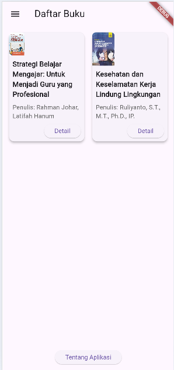
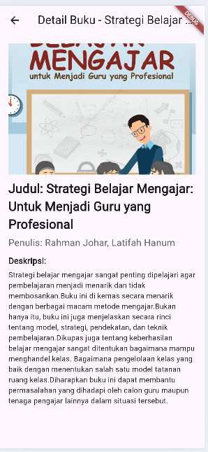
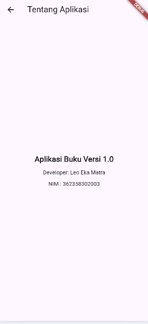
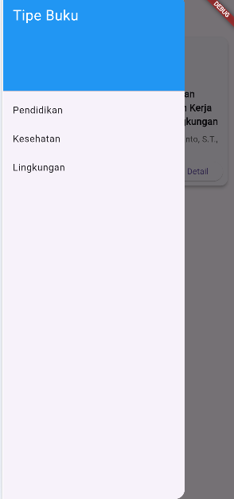

# template_project

A new Flutter project.

# Pratikum pemograman mobile 

# hasil akhir  

# Tampilan home 

# Tampilan ketika ditekan tombol detail 

# Tampilan ketika ditekan tombol tentang aplikasi 

# Ada tambahan di bagian drawner 

# penjelasan (Pemrograman mobile untuk aplikasi daftar buku melibatkan berbagai aspek, mulai dari pengembangan frontend dan backend hingga desain UI/UX dan distribusi aplikasi. Dengan menggunakan framework modern seperti Flutter, pengembang dapat menciptakan aplikasi yang menarik dan fungsional, memberikan pengalaman pengguna yang memuaskan dan memenuhi kebutuhan pengguna dalam menjelajahi dan mencari informasi buku.)